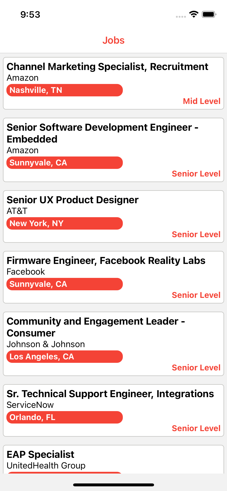
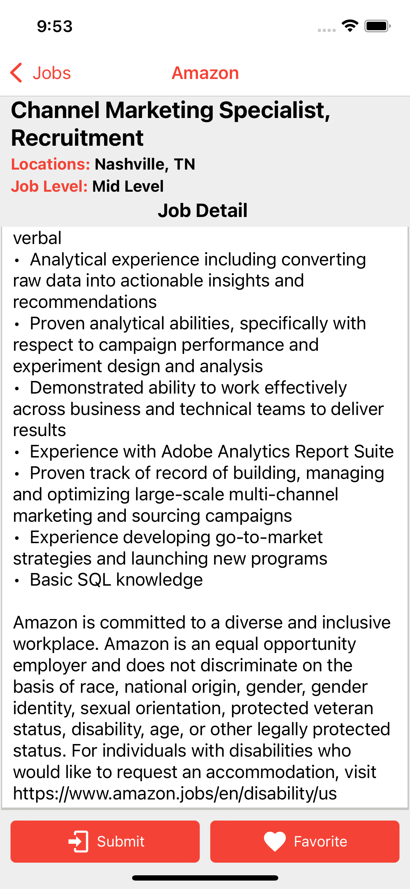

# React-Native - Kodwork 

<table>
  <tr>
    <td>First Screen Page</td>
     <td>Job Detail</td>
     <td>Job Detail favorite/submit buttons</td>
  </tr>
  <tr>
    <td></td>
    <td></td>
    <td> </td>
  </tr>
 </table>

 <table>
  <tr>
    <td>Favorite List</td>
     <td>Prevent Readding job to Favorite List</td>
  </tr>
  <tr>
    <td></td>
    <td></td>
  </tr>
 </table>


## Features

- Listing job postings with a Web API.
- Adding any job posting to favorite list.
- Prevent re-added jobs posting  to favorites
- Listing the jobs posting added to the favorite list.
- Deleting the job posting in the favorite list.

## Installation

```
git clone https://github.com/MehmetCanBOZ/React-Native-Kodwork.git
cd React-Native-Kodwork
npm init
npm install
npx react-native run-android 
npx react-native run-ios
```

## More

You can learn more at: [React documentation](https://reactnative.dev/)