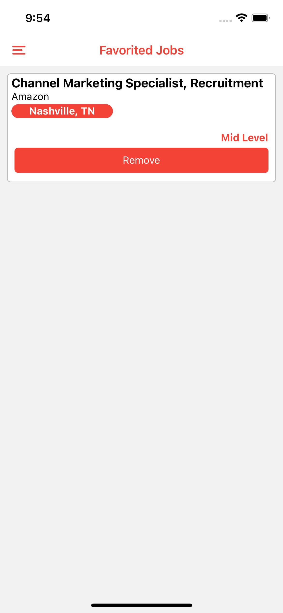

# React-Native - Kodwork 


<p float="left">
  
  
  
</p>

<p float="left">
  
  
</p>


<table>
  <tr>
    <td>First Screen Page</td>
     <td>Holiday Mention</td>
     <td>Present day in purple and selected day in pink</td>
  </tr>
  <tr>
    <td></td>
    <td></td>
    <td> </td>
  </tr>
 </table>


## Features

- Listing job postings with a Web API.
- Adding any job posting to favorite list.
- Prevent re-added jobs posting  to favorites
- Listing the jobs posting added to the favorite list.
- Deleting the job posting in the favorite list.

## Installation

```
git clone https://github.com/MehmetCanBOZ/React-Native-Kodwork.git
cd React-Native-Kodwork
npm init
npm install
npx react-native run-android 
npx react-native run-ios
```

## More

You can learn more at: [React documentation](https://reactnative.dev/)